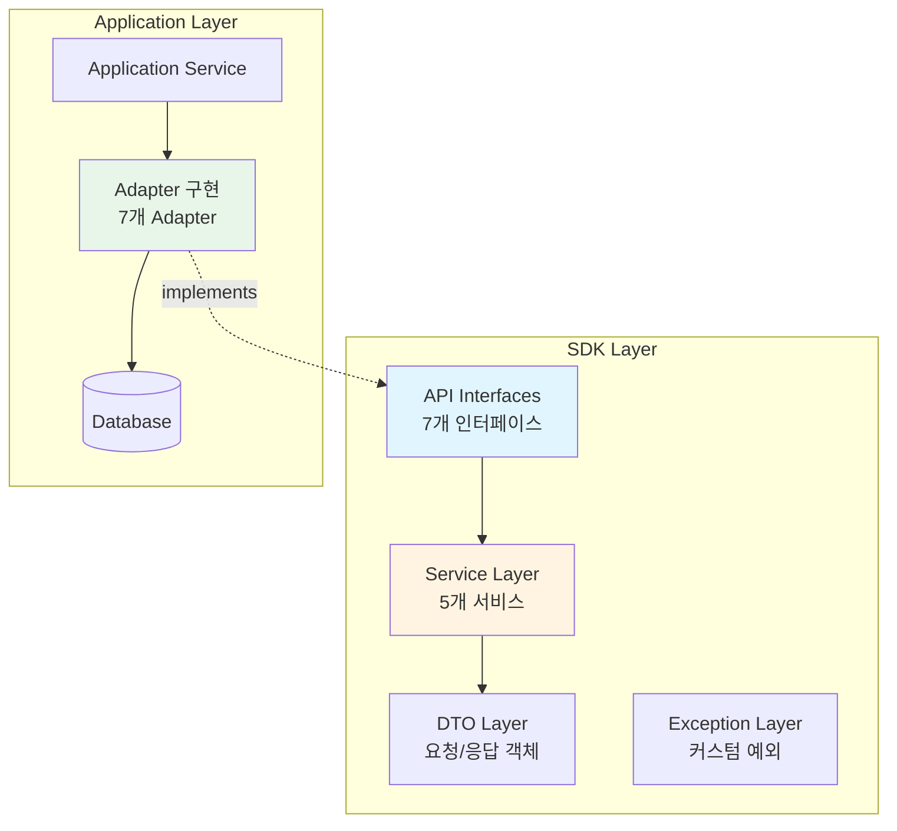
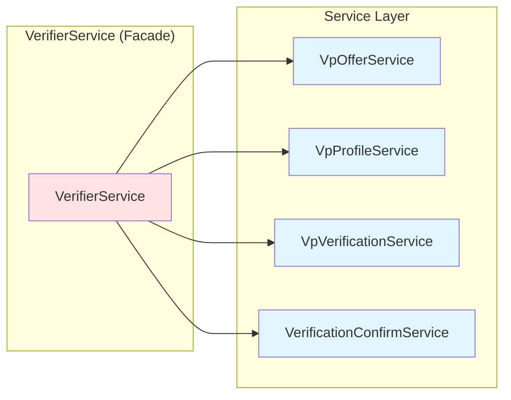
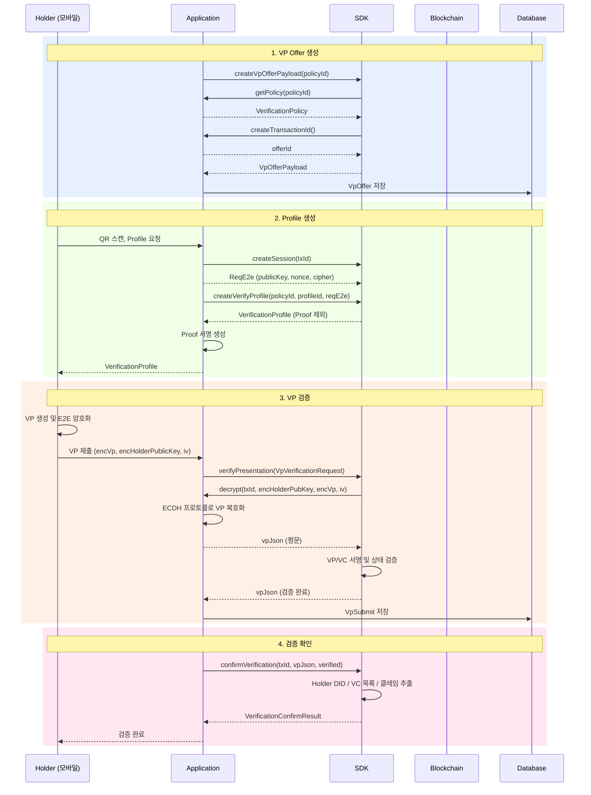

# Verifier SDK Guide

**Version**: 1.0.0  
**Last Updated**: 2026-01-26  
**Status**: Production Ready ✅

---

## 목차

1. [개요](#개요)
2. [SDK 아키텍처](#sdk-아키텍처)
3. [API 인터페이스](#api-인터페이스)
4. [서비스 계층](#서비스-계층)
5. [데이터 플로우](#데이터-플로우)
6. [DTO 구조](#dto-구조)
7. [사용 예제](#사용-예제)

---

## 개요

### SDK란?

Verifier SDK는 **VP(Verifiable Presentation) 검증 프로토콜을 추상화한 재사용 가능한 라이브러리**입니다.

### 주요 목적

- ✅ VP 검증 비즈니스 로직을 Application으로부터 분리
- ✅ 다양한 Application에서 동일한 검증 프로토콜 재사용
- ✅ 인터페이스 기반 설계로 유연한 구현 가능
- ✅ 독립적인 JAR 배포 및 버전 관리

### 핵심 기능

1. **VP Offer 생성** - QR 코드용 Offer Payload 생성
2. **Verify Profile 생성** - VP 요청을 위한 Profile 생성
3. **VP 검증** - E2E 복호화, 서명 검증, VC 검증
4. **검증 확인** - 클레임 추출 및 결과 반환

---

## SDK 아키텍처

### 전체 구조



### 계층별 역할

| 계층 | 역할 | 파일 위치 |
|------|------|----------|
| **API** | 인터페이스 정의 | `src/main/java/org/omnione/did/verifier/v1/api/` |
| **Service** | 비즈니스 로직 구현 | `src/main/java/org/omnione/did/verifier/v1/service/` |
| **DTO** | 데이터 전송 객체 | `src/main/java/org/omnione/did/verifier/v1/dto/` |
| **Exception** | 예외 정의 | `src/main/java/org/omnione/did/verifier/v1/exception/` |

---

## API 인터페이스

### 7개 핵심 인터페이스

```mermaid
classDiagram
    class VerificationConfigProvider {
        +getPolicy(policyId) VerificationPolicy
        +existsPolicy(policyId) boolean
    }

    class TransactionManager {
        +createTransactionId() String
        +getTransactionId(txId) Long
        +saveTransactionState(txId, state)
        +getTransactionState(txId) String
    }

    class E2eSessionProvider {
        +createSession(txId) ReqE2e
        +getSession(txId) ReqE2e
        +decrypt(txId, encHolderPubKey, encVp, iv) String
        +removeSession(txId)
    }

    class VerifierInfoProvider {
        +getVerifierInfo() ProviderDetail
        +getVerifierDidDocument() String
        +getVerifierDid() String
    }

    class StorageService {
        +findDidDocument(did) String
        +getVcMeta(vcId) String
        +existsDidDocument(did) boolean
    }

    class CryptoHelper {
        +verifySignature(pubKey, sig, data) boolean
        +sha256(data) String
        +decodeMultibase(multibase) byte[]
    }

    class NonceGenerator {
        +generateNonce() String
        +generateNonce(length) String
    }
```



### 인터페이스 상세

#### 1. VerificationConfigProvider

**목적**: VP 검증 정책 제공

```java
public interface VerificationConfigProvider {
    VerificationPolicy getPolicy(String policyId);
    boolean existsPolicy(String policyId);
}
```

**구현 요구사항**:
- Policy 데이터를 DB 또는 파일에서 조회
- Filter, Process, Endpoint 정보 포함

---

#### 2. TransactionManager

**목적**: Transaction 생명주기 관리

```java
public interface TransactionManager {
    String createTransactionId();
    Long getTransactionId(String txId);

    @Deprecated
    void saveTransactionState(String txId, String state);

    @Deprecated
    String getTransactionState(String txId);
}
```

> **참고**: `saveTransactionState`, `getTransactionState`는 더 이상 사용되지 않습니다.  
> 메모리 누수 방지를 위해 Application에서 DB를 통해 직접 상태를 관리하세요.

---

#### 3. E2eSessionProvider

**목적**: E2E 암호화 세션 관리

```java
public interface E2eSessionProvider {
    ReqE2e createSession(String txId);
    ReqE2e getSession(String txId);
    String decrypt(String txId, String encHolderPublicKey, String encVp, String iv);
    void removeSession(String txId);
}
```

**`decrypt()` ECDH 프로토콜**:
1. `encHolderPublicKey` 복호화 → Holder 공개키 추출
2. ECDH: Verifier 개인키 + Holder 공개키 → 공유 비밀키
3. 세션키 = KDF(공유 비밀키 + nonce)
4. VP 복호화

---

#### 4. VerifierInfoProvider

**목적**: Verifier 정보 제공

```java
public interface VerifierInfoProvider {
    ProviderDetail getVerifierInfo();
    String getVerifierDidDocument();
    String getVerifierDid();
}
```

---

#### 5. StorageService

**목적**: DID Document 및 VC Meta 조회

```java
public interface StorageService {
    String findDidDocument(String did);
    String getVcMeta(String vcId);
    boolean existsDidDocument(String did);
}
```

---

#### 6. CryptoHelper

**목적**: 암호화 유틸리티

```java
public interface CryptoHelper {
    boolean verifySignature(String publicKey, String signature, byte[] data);
    String sha256(byte[] data);
    byte[] decodeMultibase(String multibase);
}
```

---

#### 7. NonceGenerator

**목적**: Nonce 생성

```java
public interface NonceGenerator {
    String generateNonce();
    String generateNonce(int length);
}
```

---

## 서비스 계층

### 5개 핵심 서비스



### 1. VerifierService (Facade)

**역할**: SDK 진입점, 다른 서비스들을 조합

```java
public class VerifierService {
    public VpOfferPayload createVpOfferPayload(
        String policyId, String device, String service, boolean locked);

    public VerificationProfile createVerifyProfile(
        String policyId, String profileId, ReqE2e reqE2e);

    public String verifyPresentation(VpVerificationRequest request);

    public VerificationConfirmResult confirmVerification(
        String txId, String vpJson, boolean verified);
}
```

---

### 2. VpOfferService

**책임**: VP Offer Payload 생성

```java
public VpOfferPayload createVpOfferPayload(
    String policyId, String device, String service, boolean locked) {

    VerificationPolicy policy = configProvider.getPolicy(policyId);
    String offerId = transactionManager.createTransactionId();
    Instant validUntil = Instant.now()
        .plus(policy.getValidityDuration(), ChronoUnit.SECONDS);

    return VpOfferPayload.builder()
        .offerId(offerId)
        .type("VerifyOffer")
        .mode(policy.getMode())
        .endpoints(policy.getEndpoints())
        .validUntil(validUntil)
        .build();
}
```

---

### 3. VpProfileService

**책임**: Verify Profile 생성

```java
public VerificationProfile createVerifyProfile(
    String policyId, String profileId, ReqE2e reqE2e) {

    VerificationPolicy policy = configProvider.getPolicy(policyId);
    ProviderDetail verifierInfo = verifierInfoProvider.getVerifierInfo();
    String verifierNonce = nonceGenerator.generateNonce();

    return VerificationProfile.builder()
        .id(profileId)
        .type("VerifyProfile")
        .profile(ProfileContent.builder()
            .verifier(verifierInfo)
            .filter(policy.getFilter())
            .process(policy.getProcess().toBuilder()
                .reqE2e(reqE2e)
                .verifierNonce(verifierNonce)
                .build())
            .build())
        .build();
}
```

---

### 4. VpVerificationService

**책임**: VP 검증 (복호화, 서명, VC 상태)

```java
public String verifyPresentation(VpVerificationRequest request) {
    // 1. VP 복호화 (ECDH 프로토콜)
    String vpJson = decryptVp(
        request.getTxId(),
        request.getEncHolderPublicKey(),
        request.getEncVp(),
        request.getIv()
    );

    // 2. VP 파싱
    JsonObject vpObject = gson.fromJson(vpJson, JsonObject.class);

    // 3. AuthType 검증
    validateAuthType(vpObject, request.getRequiredAuthType());

    // 4. Nonce 검증
    validateNonce(vpObject, request.getVerifierNonce());

    // 5. VP 서명 검증
    validateVpSignature(vpObject);

    // 6. VC 서명 검증
    validateVcSignatures(vpObject);

    // 7. VC 상태 검증
    validateVcStatuses(vpObject);

    return vpJson;
}
```

---

### 5. VerificationConfirmService

**책임**: 클레임 추출 및 결과 반환

```java
public VerificationConfirmResult confirmVerification(
    String txId, String vpJson, boolean verified) {

    if (!verified) {
        return VerificationConfirmResult.builder()
            .txId(txId)
            .verified(false)
            .errorMessage("VP verification failed")
            .build();
    }

    JsonObject vpObject = gson.fromJson(vpJson, JsonObject.class);
    String holderDid = extractHolderDid(vpObject);
    Map<String, Object> submittedVcs = extractSubmittedVcsAsMap(vpObject);
    Map<String, Object> extractedClaims = extractClaims(vpObject);

    return VerificationConfirmResult.builder()
        .txId(txId)
        .verified(true)
        .holderDid(holderDid)
        .submittedVcs(submittedVcs)
        .extractedClaims(extractedClaims)
        .build();
}
```

---

## 데이터 플로우

### VP 검증 전체 시퀀스



---

## DTO 구조

### VpVerificationRequest

```java
@Getter
@Builder
public class VpVerificationRequest {
    private String txId;
    private String encHolderPublicKey;
    private String encVp;
    private String iv;
    private String verifierNonce;
    private Integer requiredAuthType;
}
```

---

### VerificationConfirmResult

```java
@Getter
@Builder
public class VerificationConfirmResult {
    private String txId;
    private Boolean verified;
    private String holderDid;
    private Map<String, Object> submittedVcs;
    private Map<String, Object> extractedClaims;
    private Instant verifiedAt;
    private String errorMessage;
}
```

---

### VpOfferPayload

```java
@Getter
@Builder
public class VpOfferPayload {
    private String offerId;
    private String type;
    private String mode;
    private String device;
    private String service;
    private List<String> endpoints;
    private Instant validUntil;
    private Boolean locked;
}
```

---

## 사용 예제

### 1. SDK 초기화

```java
VerificationConfigProvider configProvider =
    new VerificationConfigProviderAdapter(policyRepository);

TransactionManager transactionManager =
    new TransactionManagerAdapter(transactionService);

E2eSessionProvider e2eSessionProvider =
    new E2eSessionProviderAdapter(e2eQueryService, e2eRepository, transactionManager);

VerifierService verifierService = new VerifierService(
    configProvider,
    transactionManager,
    e2eSessionProvider,
    verifierInfoProvider,
    storageService,
    cryptoHelper,
    nonceGenerator
);
```

---

### 2. VP Offer 생성

```java
VpOfferPayload payload = verifierService.createVpOfferPayload(
    "policy-001",
    "mobile-app",
    "kyc-service",
    false
);

vpOfferRepository.save(VpOffer.builder()
    .transactionId(transactionId)
    .offerId(payload.getOfferId())
    .vpPolicyId(policyId)
    .payload(JsonUtil.serializeToJson(payload))
    .build());
```

---

### 3. VP 검증

```java
VpVerificationRequest request = VpVerificationRequest.builder()
    .txId(txId)
    .encHolderPublicKey(accE2e.getPublicKey())
    .encVp(encVp)
    .iv(accE2e.getIv())
    .verifierNonce(serverNonce)
    .requiredAuthType(authType)
    .build();

String vpJson = verifierService.verifyPresentation(request);

vpSubmitRepository.save(VpSubmit.builder()
    .transactionId(transactionId)
    .vp(vpJson)
    .holderDid(holderDid)
    .build());
```

---

### 4. 검증 확인

```java
VerificationConfirmResult result = verifierService.confirmVerification(
    txId,
    vpJson,
    true
);

if (result.getVerified()) {
    String holderDid = result.getHolderDid();
    Map<String, Object> claims = result.getExtractedClaims();
    String name = (String) claims.get("name");
    String birthDate = (String) claims.get("birthDate");
}
```

---

## 배포 가이드

### JAR 빌드

```bash
./gradlew :verifier-sdk:jar
# 결과: build/libs/verifier-sdk-1.0.0.jar
```

### 의존성 추가

```gradle
dependencies {
    implementation 'org.omnione.did:verifier-sdk:1.0.0'
}
```

### 최소 요구사항

- **Java**: 21+
- **Spring Boot**: 3.2.4+
- **Gson**: 2.10+

---

## 라이선스

Apache License 2.0

---

**Last Updated**: 2026-01-26  
**Maintainer**: OpenDID Verifier Team
