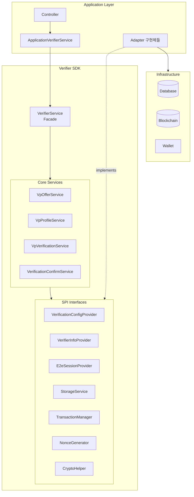
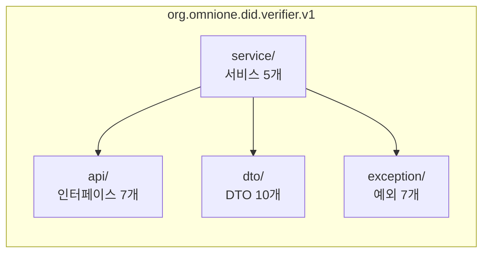
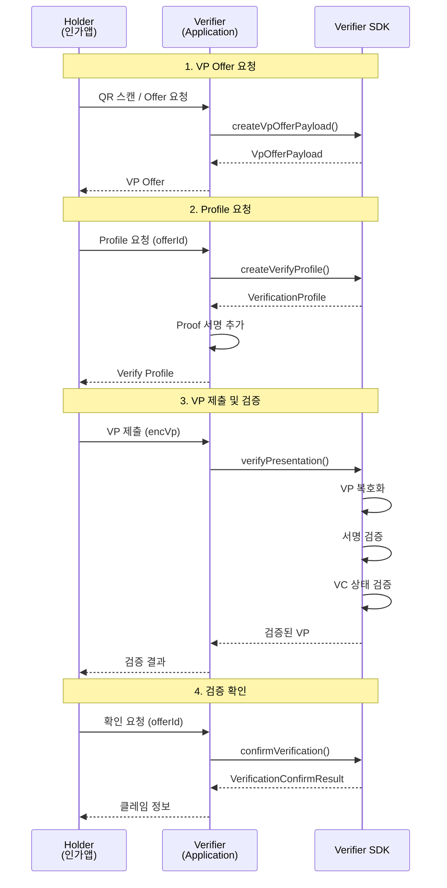
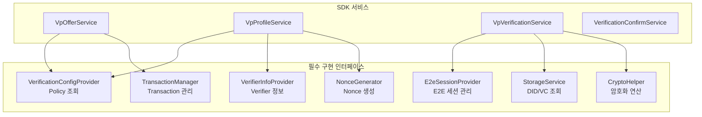
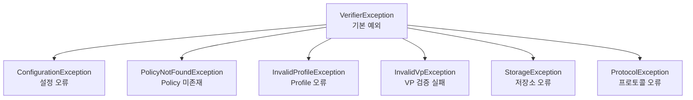

# Verifier SDK 사용 가이드

## 1. 개요

Verifier SDK는 DID(Decentralized Identifier) 기반 VP(Verifiable Presentation) 검증을 위한 핵심 프로토콜 로직을 제공합니다.

### 1.1 SDK 특징

- **프로토콜 로직 분리**: VP 검증 프로토콜 로직을 SDK로 분리하여 재사용성 확보
- **SPI(Service Provider Interface) 패턴**: 인터페이스 기반 설계로 다양한 환경에 적용 가능
- **Facade 패턴**: VerifierService를 통한 단일 진입점 제공

### 1.2 주요 기능

| 기능 | 설명 |
|------|------|
| VP Offer 생성 | QR 코드용 VP 제출 요청 생성 |
| Verify Profile 생성 | VP 제출 프로파일 생성 |
| VP 검증 | VP 복호화, 서명 검증, 상태 검증 |
| 검증 확인 | 클레임 추출 및 결과 반환 |

---

## 2. 아키텍처

### 2.1 전체 구조



### 2.2 패키지 구조



### 2.3 VP 검증 프로토콜 흐름



---

## 3. 설치 및 설정

### 3.1 의존성 추가

**Gradle (Composite Build)**
```groovy
// settings.gradle
includeBuild('path/to/verifier-sdk')

// build.gradle
dependencies {
    implementation 'org.omnione.did:verifier-sdk:1.0.0'
}
```

**Gradle (JAR 파일)**
```groovy
dependencies {
    implementation files('libs/verifier-sdk-1.0.0.jar')
}
```

### 3.2 Spring Bean 설정

```java
@Configuration
public class VerifierSdkConfig {

    @Bean
    public VerifierService verifierService(
            VerificationConfigProvider configProvider,
            VerifierInfoProvider verifierInfoProvider,
            E2eSessionProvider sessionProvider,
            StorageService storageService,
            TransactionManager transactionManager,
            NonceGenerator nonceGenerator,
            CryptoHelper cryptoHelper
    ) {
        return new VerifierService(
                configProvider,
                verifierInfoProvider,
                sessionProvider,
                storageService,
                transactionManager,
                nonceGenerator,
                cryptoHelper
        );
    }
}
```

---

## 4. 인터페이스 구현 가이드

SDK를 사용하기 위해 7개의 인터페이스를 구현해야 합니다.

### 4.1 인터페이스 의존성 관계



### 4.2 VerificationConfigProvider

Policy, Profile, Filter, Process 설정을 제공합니다.

```java
@Component
public class VerificationConfigProviderImpl implements VerificationConfigProvider {

    private final PolicyRepository policyRepository;

    @Override
    public VerificationPolicy getPolicy(String policyId) {
        // DB에서 Policy 조회 후 DTO로 변환
        Policy policy = policyRepository.findByPolicyId(policyId)
            .orElseThrow(() -> new PolicyNotFoundException(policyId));

        return VerificationPolicy.builder()
            .policyId(policy.getPolicyId())
            .policyName(policy.getName())
            .profile(buildProfile(policy))
            .filter(buildFilter(policy))
            .process(buildProcess(policy))
            .build();
    }

    @Override
    public boolean existsPolicy(String policyId) {
        return policyRepository.existsByPolicyId(policyId);
    }
}
```

### 4.3 VerifierInfoProvider

Verifier 정보 및 DID Document를 제공합니다.

```java
@Component
public class VerifierInfoProviderImpl implements VerifierInfoProvider {

    private final VerifierProperty verifierProperty;
    private final StorageService storageService;

    @Override
    public ProviderDetail getVerifierInfo() {
        return ProviderDetail.builder()
            .did(verifierProperty.getDid())
            .name(verifierProperty.getName())
            .certVcRef(verifierProperty.getCertVcRef())
            .ref(verifierProperty.getRef())
            .build();
    }

    @Override
    public String getVerifierDidDocument() {
        return storageService.findDidDocument(verifierProperty.getDid());
    }

    @Override
    public String getVerifierDid() {
        return verifierProperty.getDid();
    }
}
```

### 4.4 E2eSessionProvider

E2E 암호화 세션을 관리합니다.

```java
@Component
public class E2eSessionProviderImpl implements E2eSessionProvider {

    private final E2eRepository e2eRepository;

    @Override
    public ReqE2e createSession(String txId) {
        // 키쌍 생성
        KeyPair keyPair = generateKeyPair();
        String nonce = generateNonce();

        // DB 저장
        E2e e2e = E2e.builder()
            .txId(txId)
            .sessionKey(encode(keyPair.getPrivate()))
            .nonce(nonce)
            .curve("Secp256r1")
            .cipher("AES-256-CBC")
            .build();
        e2eRepository.save(e2e);

        return ReqE2e.builder()
            .nonce(nonce)
            .curve("Secp256r1")
            .publicKey(encode(keyPair.getPublic()))
            .cipher("AES-256-CBC")
            .padding("PKCS5")
            .build();
    }

    @Override
    public String decrypt(String txId, String encData, String iv) {
        E2e e2e = e2eRepository.findByTxId(txId);
        // ECDH + AES 복호화 수행
        return decryptWithSession(e2e, encData, iv);
    }

    // ... 기타 메소드
}
```

### 4.5 StorageService

DID Document 및 VC Meta 조회를 담당합니다.

```java
@Component
public class StorageServiceImpl implements StorageService {

    private final BlockchainClient blockchainClient;

    @Override
    public String findDidDocument(String did) {
        // 블록체인 또는 캐시에서 DID Document 조회
        return blockchainClient.getDidDocument(did);
    }

    @Override
    public String getVcMeta(String vcId) {
        // VC 메타데이터 조회 (상태 정보 포함)
        return blockchainClient.getVcMeta(vcId);
    }

    @Override
    public boolean existsDidDocument(String did) {
        return blockchainClient.existsDidDocument(did);
    }
}
```

### 4.6 TransactionManager

Transaction 상태를 관리합니다.

```java
@Component
public class TransactionManagerImpl implements TransactionManager {

    private final TransactionService transactionService;
    private final ConcurrentHashMap<String, String> stateStore = new ConcurrentHashMap<>();

    @Override
    public String createTransactionId() {
        return UUID.randomUUID().toString();
    }

    @Override
    public void saveTransactionState(String txId, String state) {
        stateStore.put(txId, state);
    }

    @Override
    public String getTransactionState(String txId) {
        return stateStore.get(txId);
    }

    @Override
    public Long getTransactionId(String txId) {
        Transaction tx = transactionService.findByTxId(txId);
        return tx.getId();
    }

    // ... 기타 메소드
}
```

### 4.7 NonceGenerator

암호학적으로 안전한 Nonce를 생성합니다.

```java
@Component
public class NonceGeneratorImpl implements NonceGenerator {

    @Override
    public String generateNonce(int length) {
        byte[] nonce = new byte[length];
        new SecureRandom().nextBytes(nonce);
        return Base64.getEncoder().encodeToString(nonce);
    }

    @Override
    public String generateNonce() {
        return generateNonce(16);
    }
}
```

### 4.8 CryptoHelper

서명 검증, 해시 생성 등 암호화 연산을 수행합니다.

```java
@Component
public class CryptoHelperImpl implements CryptoHelper {

    @Override
    public boolean verifySignature(String publicKey, String signature, byte[] data) {
        try {
            // Multibase 디코딩 후 서명 검증
            byte[] pubKeyBytes = decodeMultibase(publicKey);
            byte[] sigBytes = decodeMultibase(signature);
            return doVerify(pubKeyBytes, sigBytes, data);
        } catch (Exception e) {
            return false;
        }
    }

    @Override
    public String sha256(byte[] data) {
        byte[] hash = MessageDigest.getInstance("SHA-256").digest(data);
        return Base64.getEncoder().encodeToString(hash);
    }

    @Override
    public byte[] decodeMultibase(String multibase) {
        // Multibase 디코딩 구현
    }

    @Override
    public String encodeBase64(byte[] data) {
        return Base64.getEncoder().encodeToString(data);
    }

    @Override
    public byte[] decodeBase64(String base64) {
        return Base64.getDecoder().decode(base64);
    }
}
```

---

## 5. 사용 예제

### 5.1 VP Offer 생성

```java
@Service
@RequiredArgsConstructor
public class MyVerifierService {

    private final VerifierService verifierService;

    public VpOfferPayload createOffer(String policyId) {
        return verifierService.createVpOfferPayload(
            policyId,
            "WEB",           // device
            "login",         // service
            false            // locked
        );
    }
}
```

### 5.2 Verify Profile 생성

```java
public VerifyProfile createProfile(String policyId, String txId) {
    // 1. E2E 세션 생성 (Application에서 처리)
    ReqE2e reqE2e = e2eSessionProvider.createSession(txId);

    // 2. SDK를 통해 Profile 생성
    VerificationProfile sdkProfile = verifierService.createVerifyProfile(
        policyId,
        UUID.randomUUID().toString(),
        reqE2e
    );

    // 3. Application에서 Proof 서명 추가
    VerifyProfile appProfile = convertToAppProfile(sdkProfile);
    appProfile.setProof(generateProof(appProfile));

    return appProfile;
}
```

### 5.3 VP 검증

```java
public String verifyVp(String txId, String encVp, String iv, String verifierNonce) {
    VpVerificationRequest request = VpVerificationRequest.builder()
        .txId(txId)
        .encVp(encVp)
        .iv(iv)
        .verifierNonce(verifierNonce)
        .requiredAuthType(0)  // 인증 타입 (0: 제한 없음)
        .build();

    // SDK가 복호화, 서명 검증, 상태 검증 수행
    return verifierService.verifyPresentation(request);
}
```

### 5.4 검증 확인

```java
public VerificationConfirmResult confirmVerification(String txId, String vpJson) {
    return verifierService.confirmVerification(
        txId,
        vpJson,
        true  // verified
    );
}
```

---

## 6. DTO 레퍼런스

### 6.1 VpOfferPayload

```java
public class VpOfferPayload {
    private String offerId;      // Offer ID (Dynamic QR용)
    private String type;         // "VerifyOffer"
    private String mode;         // "Direct" | "Indirect"
    private String device;       // 응대장치 식별자
    private String service;      // 서비스 식별자
    private List<String> endpoints;  // Verifier API 엔드포인트
    private Instant validUntil;  // 유효 기간
    private Boolean locked;      // Offer 잠김 여부
}
```

### 6.2 VerificationProfile

```java
public class VerificationProfile {
    private String id;           // Profile ID
    private String type;         // "VerifyProfile"
    private String title;        // 프로파일 제목
    private String description;  // 프로파일 설명
    private String encoding;     // "UTF-8"
    private String language;     // "ko", "en"
    private ProfileContent profile;  // 내부 구조

    public static class ProfileContent {
        private ProviderDetail verifier;  // Verifier 정보
        private FilterInfo filter;        // Filter 정보
        private ProcessInfo process;      // Process 정보
    }
}
```

### 6.3 VpVerificationRequest

```java
public class VpVerificationRequest {
    private String txId;            // Transaction ID
    private String encVp;           // 암호화된 VP
    private String iv;              // Initial Vector
    private String verifierNonce;   // Verifier Nonce
    private Integer requiredAuthType;  // 요구 인증 타입
}
```

### 6.4 VerificationConfirmResult

```java
public class VerificationConfirmResult {
    private String txId;                        // Transaction ID
    private Boolean verified;                   // 검증 성공 여부
    private String holderDid;                   // Holder DID
    private Map<String, Object> submittedVcs;   // 제출된 VC 목록
    private Map<String, Object> extractedClaims; // 추출된 클레임
    private Instant verifiedAt;                 // 검증 일시
    private String errorMessage;                // 오류 메시지
    private String errorCode;                   // 오류 코드
}
```

---

## 7. 예외 처리

### 7.1 예외 클래스 계층



### 7.2 예외 처리 예제

```java
try {
    String vpJson = verifierService.verifyPresentation(request);
    // 검증 성공
} catch (InvalidVpException e) {
    // VP 검증 실패 (서명 오류, Nonce 불일치 등)
    log.error("VP verification failed: {}", e.getMessage());
} catch (StorageException e) {
    // DID Document 또는 VC Meta 조회 실패
    log.error("Storage error: {}", e.getMessage());
} catch (VerifierException e) {
    // 기타 SDK 예외
    log.error("Verifier error: {}", e.getMessage());
}
```

---

## 8. 부록

### 8.1 AuthType 비트 플래그

| 값 | 의미 |
|----|------|
| 0x00000000 | 인증 제한 없음 |
| 0x00000002 | PIN 인증 |
| 0x00000004 | BIO 인증 |
| 0x00000006 | PIN 또는 BIO |
| 0x00008006 | PIN 그리고 BIO |

### 8.2 VC 상태 값

| 상태 | 설명 |
|------|------|
| ACTIVE | 유효 (검증 통과) |
| REVOKED | 폐기됨 (검증 실패) |
| INACTIVE | 중지됨 (검증 실패) |
| EXPIRED | 만료됨 (검증 실패) |

### 8.3 버전 정보

- SDK 버전: 1.0.0
- Java 버전: 21+
- Spring Boot 호환: 3.2.x
